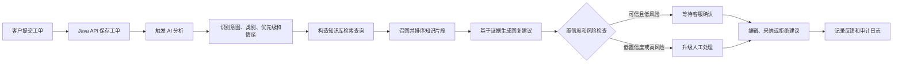
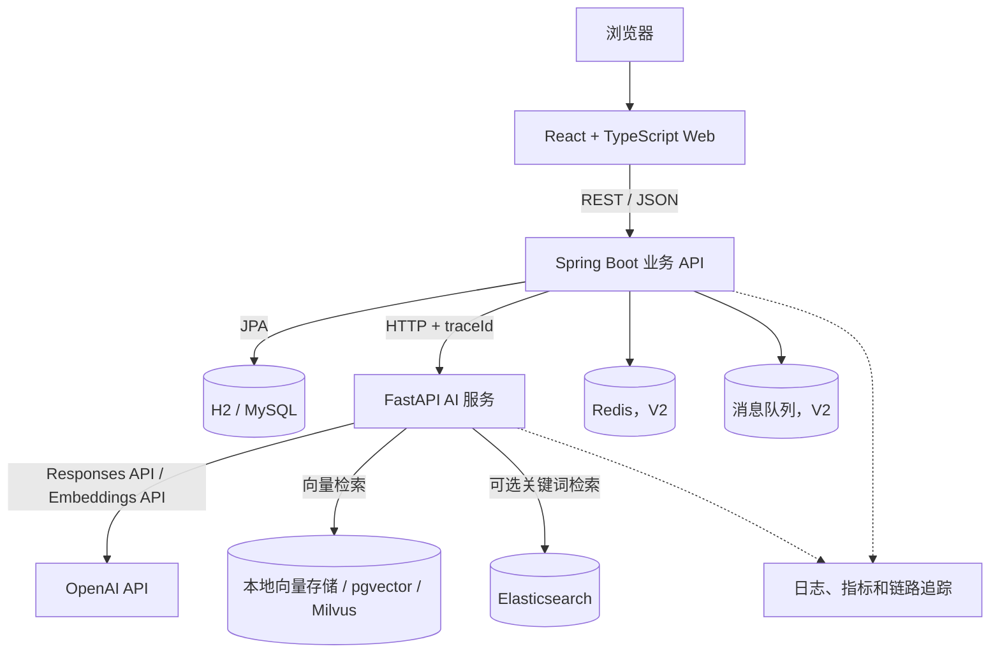
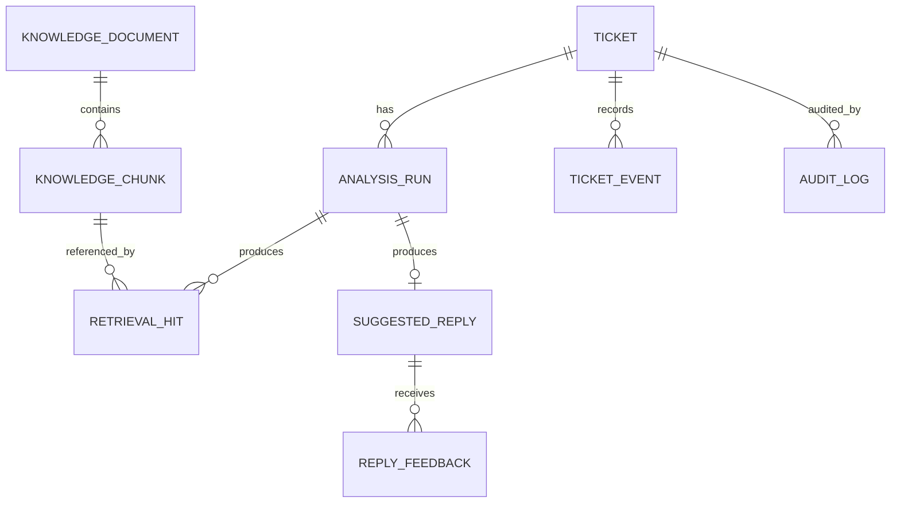
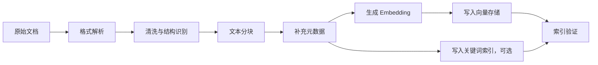

# Support Copilot 项目总纲

> 企业级智能工单路由与知识库辅助平台

| 文档属性 | 内容 |
| --- | --- |
| 项目代号 | Support Copilot |
| 中文名称 | 企业级智能工单路由与知识库辅助平台 |
| 文档定位 | 产品说明、技术设计、实施路线、学习地图和面试材料的统一基线 |
| 当前阶段 | V1 联调与验证期 |
| 文档版本 | 1.1.0 |
| 最后更新 | 2026-07-28 |
| 维护原则 | 代码、接口或架构发生重要变化时，同步更新本文档 |

---

## 1. 文档用途

本文档是 Support Copilot 项目的长期维护总纲，用于解决以下问题：

1. 明确项目要解决的业务问题，防止开发过程只剩技术堆砌。
2. 明确 V1、V2 的功能边界，控制项目规模并保证每个阶段都能演示。
3. 记录技术栈、架构边界、数据模型、接口设计和关键技术决策。
4. 把需要学习的知识与项目功能对应起来，形成可以执行的学习路线。
5. 为后续测试、优化、部署、简历撰写和面试讲解提供统一依据。
6. 清楚区分已经实现、计划实现和远期设想，避免文档把计划误写成事实。

本文档优先描述“为什么这样设计”和“做到什么程度算完成”。具体启动命令、环境变量和开发操作可在后续补充到根目录 `README.md` 中。

### 1.1 与独立学习资料的关系

Support Copilot 已从 `CY-Agent` 学习仓库中独立出来。两个仓库承担不同职责：

| 文件或目录 | 职责 |
| --- | --- |
| `../CY-Agent/MISSION.md` | 记录早期 LangChain RAG 学习目标，反映项目形成前的学习阶段 |
| `../CY-Agent/GLOSSARY.md` | 记录已经理解并能解释的 RAG 术语 |
| `../CY-Agent/RESOURCES.md` | 保存学习资料和官方参考链接 |
| `../CY-Agent/lessons/` | RAG 理论课程和交互练习 |
| `../CY-Agent/learning-records/` | 已掌握知识的过程性证据 |
| `docs/PROJECT_BLUEPRINT.md` | 当前完整项目的产品和工程总纲 |

`CY-Agent/MISSION.md` 中“暂不包含 TypeScript 和 Java”的约束属于早期学习阶段。当前项目已经进入综合工程实践阶段，因此实现范围以本文档为准；原学习记录继续在独立学习仓库中保留，作为知识成长轨迹。

---

## 2. 项目概述

### 2.1 一句话介绍

Support Copilot 是一个面向客服与技术支持团队的企业 SaaS 后台：系统接收客户工单，自动识别问题类型与紧急程度，从企业知识库检索可追溯的依据，生成带引用的回复建议，并把检索、生成、置信度和人工处理过程可视化。

### 2.2 项目背景

企业客服系统经常面对以下问题：

- 工单来自邮件、在线客服、网页表单等多个渠道，内容和格式不统一。
- 人工分类和分配速度慢，同一问题可能被分给错误团队。
- 客服人员需要在大量文档中查找产品政策、故障手册和标准处理流程。
- 大语言模型可以生成流畅回复，但如果没有企业资料约束，容易产生幻觉。
- 管理者只能看到最终回复，看不到系统为什么检索某篇文档、为什么给出某个优先级。
- AI 服务可能超时、限流或不可用，业务系统仍需保持基本可用。

本项目用“工单处理”作为企业场景，把普通后台开发、服务集成、RAG、模型调用、可观测性和评估串成一条完整业务链路。

### 2.3 核心业务价值

系统的价值不是“用 AI 聊天”，而是改善一个具体工作流：

| 业务问题 | 系统能力 | 可观察结果 |
| --- | --- | --- |
| 工单分类慢 | 自动识别意图、类别和优先级 | 首次分派时间下降 |
| 查资料耗时 | 语义或混合检索知识库 | 知识查找耗时下降 |
| 回复质量不稳定 | 基于证据生成回复建议 | 回复更一致、可复核 |
| 模型结论不透明 | 展示业务级处理轨迹 | 人员可以理解和纠正结果 |
| AI 不可靠 | 超时、重试、降级和人工接管 | 外部服务异常时工单仍可处理 |
| 无法持续优化 | 反馈、评估集和质量指标 | 能定位是检索问题还是生成问题 |

### 2.4 为什么适合作为简历项目

这个项目不是单一 CRUD 系统，也不是一个只调用模型 API 的聊天页面。它能展示多层能力：

- 前端：企业后台信息架构、复杂状态、图表和过程可视化。
- Java 后端：REST API、分层架构、数据建模、校验、安全与外部服务调用。
- Python AI 服务：模型调用、结构化输出、RAG 流程和异常降级。
- 数据工程：文档导入、清洗、分块、Embedding、索引与检索。
- AI 工程：Prompt 版本、证据约束、引用、评估、成本和延迟管理。
- 工程化：测试、Docker Compose、日志、指标、CI/CD 和配置管理。
- 产品思维：把 AI 能力嵌入明确的人工工作流，而不是为了 AI 而 AI。

对招聘者而言，它能够同时提供“技术关键词”和“可运行证据”。对技术面试官而言，它能引出架构权衡、失败处理、质量评估和系统演进等深入问题。

---

## 3. 项目定位与真实性边界

### 3.1 项目定位

本项目定位为：

- 面试演示用的综合企业后台。
- 可本地运行、可录屏、可部署的完整作品。
- 以真实企业需求为参考构建的模拟业务系统。
- 用于证明个人具备从需求到落地的全栈和 AI 应用工程能力。

### 3.2 不应包装成什么

本项目不应被描述为：

- 已在某家真实企业生产环境运行的系统。
- 已服务大量真实客户或产生真实收入的商业产品。
- 已在未经实际压测的情况下支撑百万级请求。
- 仅凭模型输出就能完全替代人工客服的自动化系统。

### 3.3 面试中的准确表达

推荐表达：

> 这是我基于企业客服场景独立设计并实现的工程化项目。我使用模拟工单和自建知识文档完成端到端流程，并通过测试集、日志和指标验证检索与生成效果。它没有在真实公司生产环境上线，因此我会把压测结果、设计容量和真实生产经验明确区分。

这种表达不会削弱项目价值，反而说明候选人理解工程事实和职业诚信。

---

## 4. 目标用户与典型角色

### 4.1 一线客服人员

主要任务：

- 查看待处理工单。
- 理解客户问题和历史上下文。
- 查看系统推荐分类、优先级和知识依据。
- 修改并发送建议回复。
- 对不可靠结果进行纠正或升级。

### 4.2 客服组长

主要任务：

- 监控工单量、SLA 风险和积压情况。
- 处理高优先级或低置信度工单。
- 查看自动分类准确率和人工采纳率。
- 发现知识库缺口和高频问题。

### 4.3 知识库管理员

主要任务：

- 导入、更新、下线知识文档。
- 查看文档分块和索引状态。
- 检查检索结果是否相关。
- 维护文档版本、有效期和访问范围。

### 4.4 系统管理员或审计人员

主要任务：

- 管理用户、角色和权限。
- 检查模型调用记录、错误和成本。
- 追踪谁在何时修改或发送了回复。
- 检查敏感信息、操作日志和安全事件。

### 4.5 面试演示者

项目的特殊使用者。需要在 8 至 10 分钟内清楚展示：

- 业务问题。
- 完整工单流程。
- AI 与 RAG 的真实作用。
- 可视化追踪和人工控制。
- 异常降级和质量评估。
- 技术架构和关键取舍。

---

## 5. 项目目标

### 5.1 产品目标

1. 建立一个结构完整、可交互的企业 SaaS 工单后台。
2. 完成从工单创建到分析、检索、回复建议和人工确认的闭环。
3. 让用户能够看到每一步业务处理状态、耗时、结果和证据来源。
4. 当 AI 服务不可用时，系统仍能查看和人工处理工单。
5. 提供能持续衡量分类、检索和回答质量的评估能力。

### 5.2 技术目标

1. 使用 React、TypeScript、Java、Spring Boot、Python 和 FastAPI 形成多服务系统。
2. 使用 OpenAI API 完成文本理解、结构化分类、Embedding 和回复生成。
3. 使用 RAG 限制生成依据，并返回可追踪引用。
4. 使用关系数据库保存业务数据，使用向量存储支持语义检索。
5. 使用统一 `traceId` 追踪一次分析请求在多个服务中的过程。
6. 通过单元测试、集成测试和端到端测试保证关键流程。
7. 在 V2 使用容器编排和 CI/CD 提升可复现性。

### 5.3 学习目标

完成项目后，应能不依赖背诵回答以下问题：

- 为什么要把业务后端和 AI 服务拆开？
- RAG 与模型训练、微调有什么区别？
- 文档为什么需要分块，如何选择分块大小与重叠？
- 语义检索、关键词检索、混合检索和重排序分别解决什么问题？
- 相似度高为什么不代表答案正确？
- 如何区分检索失败、生成失败和资料本身错误？
- 如何避免模型返回不可解析的自由文本？
- 如何实现超时、重试、熔断和降级？
- 如何计算 Hit Rate@K、Precision@K、Recall@K、MRR 和证据忠实度？
- 如何控制提示注入、敏感信息泄露、成本和延迟？
- 如何从单机演示版本演进到可部署的企业系统？

### 5.4 可衡量的 V1 完成标准

V1 达到以下条件才算完成：

- 可以创建并查看至少 12 条覆盖不同类别的演示工单。
- 可以选择任一工单并触发分析。
- 页面能展示分类、优先级、情绪、置信度、升级建议和简短业务理由。
- 页面能展示至少 3 个检索片段、相似度或排序信息以及来源。
- 能生成带引用的回复建议，并允许人工编辑。
- OpenAI API 未配置或 AI 服务不可用时，系统返回明确的演示降级结果。
- 仪表盘能展示工单量、分类分布、平均处理耗时和 AI 建议采纳率等指标。
- 前端构建、Java 测试和 Python 测试可以通过。
- 仓库有完整运行说明、架构说明、演示脚本和简历表述。

---

## 6. 非目标范围

以下内容不是 V1 的目标：

- 真正发送邮件、短信或第三方客服消息。
- 对接真实企业 CRM、ERP、订单或支付系统。
- 完整实现多租户计费和商业化订阅。
- 让模型自动发送高风险回复。
- 训练或微调基础大模型。
- 自己实现向量数据库、分词器或搜索引擎。
- 追求未经验证的超大并发和微服务数量。
- 展示模型隐藏的思维链。
- 用炫技动画代替业务信息。

V2 可以增加接近生产环境的能力，但仍需保持项目可理解、可运行、可演示。

---

## 7. 核心业务流程

### 7.1 主流程



### 7.2 工单状态

建议状态机：

```text
NEW -> ANALYZING -> READY_FOR_REVIEW -> IN_PROGRESS -> RESOLVED -> CLOSED
                    |                  |
                    v                  v
              NEEDS_ESCALATION     WAITING_CUSTOMER

ANALYZING -> ANALYSIS_FAILED -> READY_FOR_MANUAL_REVIEW
```

状态约束：

- 工单创建后默认为 `NEW`。
- 分析期间进入 `ANALYZING`，防止重复触发。
- 分析成功后根据风险进入 `READY_FOR_REVIEW` 或 `NEEDS_ESCALATION`。
- AI 分析失败不能阻止人工处理，失败后进入 `READY_FOR_MANUAL_REVIEW`。
- 只有具备权限的用户可以关闭或重新打开工单。
- 每次状态变化都写入审计日志。

### 7.3 一次分析运行的阶段

| 阶段 | 输入 | 输出 | 失败策略 |
| --- | --- | --- | --- |
| 预处理 | 标题、正文、渠道、语言 | 清洗文本、语言、敏感字段标记 | 保留原文，标记预处理失败 |
| 工单理解 | 清洗后的工单 | 类别、意图、优先级、情绪、置信度 | 使用规则或默认分类降级 |
| 查询构造 | 工单与分类结果 | 一个或多个检索查询 | 使用标题与正文作为原始查询 |
| 知识检索 | 查询、租户和分类过滤 | 候选知识片段 | 返回空结果并进入证据不足流程 |
| 重排序 | 问题与候选片段 | 最终 Top K 证据 | 保留初始排序 |
| 回复生成 | 工单、最终证据、回复规则 | 建议回复、引用和警告 | 不生成回复，提示人工处理 |
| 风险检查 | 分类、回复、证据 | 升级建议、风险原因 | 默认升级人工 |
| 持久化 | 全部结构化结果 | 分析记录、检索记录、回复版本 | 记录错误并允许重试 |

---

## 8. 功能范围与版本规划

### 8.1 V1：可运行的端到端演示版

V1 的目标是证明主流程完整，不追求所有企业功能。

#### 8.1.1 工作台与仪表盘

- 今日新建、待处理、高优先级、SLA 风险工单数量。
- 工单类别分布。
- 最近 7 天工单趋势。
- AI 分析成功率和平均耗时。
- 建议回复采纳率。
- 最近异常或低置信度工单列表。

#### 8.1.2 工单队列

- 按状态、类别、优先级、渠道和负责人筛选。
- 按创建时间、SLA 截止时间和优先级排序。
- 搜索工单编号、标题和客户名称。
- 查看未读、升级、分析失败和 SLA 风险标记。
- 选择工单后保持列表位置，减少演示中的页面跳转。

#### 8.1.3 工单详情

- 工单基础信息、客户问题、时间线和当前状态。
- AI 建议分类、优先级、情绪和简短理由。
- 原分类与 AI 建议差异。
- 手动修正分类和优先级。
- 触发重新分析。

#### 8.1.4 AI 处理轨迹

- 展示“预处理、分类、检索、生成、风险检查”等业务步骤。
- 展示每步的状态、开始时间、耗时和结构化结果摘要。
- 展示所使用的 Prompt 版本、模型配置标识和 `traceId`。
- 展示 token 使用量和估算成本时，必须标明其计算依据。
- 不展示或伪造模型隐藏思维链，只展示可审计的输入摘要、输出字段和业务理由。

#### 8.1.5 RAG 检索结果

- 展示最终使用的 Top K 知识片段。
- 展示文档标题、版本、章节、片段正文和来源标识。
- 展示初始排名、最终排名以及相似度或重排序分数。
- 高亮与查询相关的关键内容。
- 明确标识“已作为生成证据”和“仅召回但未使用”的片段。

#### 8.1.6 建议回复

- 生成简洁、专业、符合客服语气的回复草稿。
- 每个关键结论附带可追踪引用。
- 证据不足时明确说明，不允许模型自行补全政策。
- 允许人工编辑、采纳、拒绝和重新生成。
- 记录人工修改前后的差异和反馈结果。

#### 8.1.7 演示数据

建议至少覆盖以下主题：

- 退款政策咨询。
- 账号无法登录。
- 发票开具或抬头修改。
- 服务异常或疑似故障。
- 套餐升级和费用问题。
- 数据导出与隐私请求。
- 重复扣款或高风险支付问题。
- 功能使用方法。
- 知识库没有直接依据的问题。
- 包含错误码、产品名称等精确关键词的问题。

### 8.2 V1.5：质量与可解释性增强

- 文档上传、解析、分块预览和索引状态。
- Prompt 模板版本管理。
- 检索参数面板，例如 Top N、Top K、阈值和元数据过滤。
- 评估数据集管理。
- 检索效果对比，例如纯向量检索与混合检索。
- 回复人工采纳、编辑距离和纠错原因统计。
- Server-Sent Events 展示处理进度。
- 更完整的角色权限和审计日志。

### 8.3 V2：企业化演进版

- MySQL 持久化业务数据。
- Redis 缓存、幂等键、限流和短期任务状态。
- pgvector 或 Milvus 作为独立向量检索能力，并通过基准测试选择。
- 可选 Elasticsearch，用于 BM25、过滤和混合检索实验。
- 文档对象存储，例如 MinIO 或兼容 S3 的服务。
- Docker Compose 一键启动本地依赖。
- GitHub Actions 执行构建、测试和镜像检查。
- JWT 或 OAuth2 登录与 RBAC 权限控制。
- 消息队列处理异步分析和知识库索引任务。
- OpenTelemetry、Prometheus 和 Grafana 可观测性。
- 多租户数据隔离设计。
- Prompt 和检索策略 A/B 测试。
- 离线评估、在线反馈和回归基线。

### 8.4 暂不进入 V2 的高成本方向

- 自主执行外部操作的多智能体系统。
- 自动退款、封号或修改客户数据等高风险工具调用。
- Kubernetes 集群部署。
- 大规模模型微调。
- 复杂商业计费系统。

这些方向可以在文档中说明演进思路，但只有真正实现和验证后才能写进简历成果。

---

## 9. 页面与交互设计

### 9.1 视觉定位

界面采用克制的企业 SaaS 后台风格：

- 浅色背景、清晰分区和较高信息密度。
- 主色用于状态和关键操作，不使用大面积紫蓝渐变。
- 不使用科幻光效、漂浮装饰或“AI 魔法”式文案。
- 图表服务于运营判断，不为了装饰而展示。
- 卡片只用于独立数据单元，不在卡片中继续嵌套卡片。
- 桌面端优先，同时保证常见笔记本分辨率下不溢出。

### 9.2 信息架构

建议导航结构：

```text
工作台
工单中心
  - 全部工单
  - 待审核
  - 升级处理
知识库
  - 文档管理
  - 检索调试
质量评估
  - 评估集
  - 运行报告
系统管理
  - 用户与角色
  - 模型与 Prompt 配置
  - 审计日志
```

V1 可以只实现“工作台”和“工单中心”，其余导航在对应功能可用前不应做成无法点击的装饰入口。

### 9.3 工单工作区布局

推荐三段式工作区：

| 区域 | 内容 | 设计原因 |
| --- | --- | --- |
| 左侧 | 工单列表、筛选和搜索 | 快速切换案例，适合演示和重复处理 |
| 中间 | 工单正文、客户信息、状态和时间线 | 保持业务对象始终可见 |
| 右侧 | AI 分析、知识证据和回复建议标签页 | 把辅助信息与原始事实区分 |

在较窄屏幕下，右侧区域改为抽屉或标签页，避免三列同时挤压正文。

### 9.4 AI 可视化原则

可视化的对象是“系统做了什么”，不是“模型私下想了什么”。页面可以展示：

- 步骤名称和状态。
- 业务输入摘要。
- 结构化结果。
- 采用的知识证据。
- 规则命中情况。
- 耗时、错误、重试和降级状态。
- 简短、可审计的决策理由。

页面不展示：

- 隐藏思维链或伪造的长篇推理过程。
- 无法被系统日志验证的动画步骤。
- 用“智能指数”等模糊分数代替真实指标。

---

## 10. 总体技术架构

### 10.1 架构图



### 10.2 服务职责

#### React Web

负责：

- 用户交互和页面状态。
- 工单、分析轨迹、检索证据和指标展示。
- 表单校验、筛选、排序和错误反馈。
- 不保存 API 密钥，不直接调用 OpenAI。

#### Spring Boot 业务 API

负责：

- 工单、用户、角色、状态流转和审计等核心业务。
- 数据校验和权限检查。
- 协调 AI 服务并持久化结果。
- 控制超时、重试、幂等和降级。
- 对前端提供稳定 API，隔离 AI 服务的变化。

#### FastAPI AI 服务

负责：

- 工单文本预处理和查询构造。
- 调用 OpenAI 模型并解析结构化结果。
- 文档分块、Embedding、检索、重排序和引用组装。
- Prompt 模板与版本管理。
- 评估 AI 和 RAG 质量。
- 在没有 API Key 时提供明确标记的 mock 模式。

#### 数据与基础设施

负责：

- 关系数据库保存业务事实和审计记录。
- 向量存储保存知识片段及其 Embedding。
- Redis 保存缓存、幂等状态和限流计数。
- 对象存储保存原始知识文件。
- 消息队列解耦耗时任务。

### 10.3 为什么拆分 Java 与 Python

拆分的主要原因：

- Java/Spring Boot 更适合展示企业业务系统的分层、事务、安全和数据建模。
- Python 的 AI、RAG、评估和数据处理生态更成熟。
- 业务 API 不应绑定某个模型 SDK，模型替换对前端保持透明。
- AI 服务可以独立扩缩容、限流和发布。

拆分也会增加网络调用、部署和故障处理复杂度。V1 仍保留该边界，是因为“跨服务可靠调用”本身就是本项目希望展示的能力，而不是为了增加服务数量。

---

## 11. 技术栈

### 11.1 已落地的前端技术

| 技术 | 当前版本 | 用途 | 招聘信号 |
| --- | --- | --- | --- |
| React | 19.2.x | 组件化界面和状态驱动渲染 | 主流前端框架能力 |
| TypeScript | 6.0.x | 类型约束、接口模型和可维护性 | 中大型前端基础能力 |
| Vite | 8.1.x | 本地开发和生产构建 | 现代前端工程化 |
| Ant Design | 6.5.x | 表格、表单、布局、反馈和企业组件 | 企业后台开发能力 |
| ECharts | 6.1.x | 工单趋势、类别分布和质量指标 | 数据可视化能力 |
| lucide-react | 1.27.x | 一致的工具图标 | 交互细节和设计一致性 |
| Oxlint | 1.71.x | 代码静态检查 | 代码质量意识 |

后续建议补充：

- React Router：页面路由和权限路由。
- TanStack Query：服务端状态、缓存、重试和失效管理。
- Vitest + React Testing Library：组件和逻辑测试。
- Playwright：关键演示流程端到端测试和截图验证。

### 11.2 已落地的 Java 后端技术

| 技术 | 当前版本或状态 | 用途 | 招聘信号 |
| --- | --- | --- | --- |
| Java | 21 | 主要业务语言 | LTS Java 和现代语言特性 |
| Spring Boot | 4.0.0 | 应用框架 | 企业 Java 后端能力 |
| Spring Web MVC | 已配置 | REST API | Web 服务开发 |
| Spring Data JPA | 已配置 | 持久化和仓储层 | ORM 和数据访问 |
| Spring Validation | 已配置 | 请求参数和领域校验 | API 边界质量 |
| Spring Security | 已配置 | 认证授权基础 | 企业安全能力 |
| Spring Actuator | 已配置 | 健康检查与运行指标 | 可运维性 |
| H2 | 已配置 | V1 本地数据库 | 快速启动和测试 |
| MySQL Driver | 已配置 | V2 业务数据库 | 企业关系数据库 |
| Lombok | 已配置 | 减少样板代码 | 常见 Java 工具链 |
| Gradle Wrapper | 已配置 | 可复现构建 | 构建工程化 |
| JUnit Platform | 已配置 | 自动化测试 | 后端测试能力 |

说明：项目当前使用 Spring Boot 4.0.0。求职时还需要理解 Spring Boot 3.x，因为大量企业项目仍处于 3.x 或迁移阶段。是否降级不应只看招聘关键词，而应根据依赖兼容性和项目稳定性决定。

### 11.3 计划中的 Python AI 技术

| 技术 | 用途 | 选择原因 |
| --- | --- | --- |
| Python 3.11 | AI 服务语言 | 与当前环境兼容，AI 生态成熟 |
| FastAPI | HTTP API 和自动 OpenAPI 文档 | 类型友好、开发效率高、适合独立 AI 服务 |
| Pydantic | 输入输出模型和结构校验 | 防止自由文本污染服务边界 |
| Uvicorn | ASGI 本地运行 | FastAPI 常见运行方式 |
| OpenAI Python SDK | 模型和 Embedding 调用 | 官方 SDK，减少自定义协议代码 |
| Responses API | 结构化文本生成和后续工作流扩展 | 统一的现代 API 边界 |
| Structured Outputs | 分类和分析结果 Schema 约束 | 提高结果可解析性和可测试性 |
| LangChain | 文档、检索和 RAG 组件编排 | 与现有学习路线一致，适合展示生态理解 |
| pytest | 单元和集成测试 | Python 主流测试工具 |
| httpx | 服务调用与测试客户端 | 支持异步 HTTP 场景 |

模型名不写死在代码中，统一通过环境变量配置：

- `OPENAI_API_KEY`
- `OPENAI_BASE_URL`，仅在使用兼容网关时配置
- `OPENAI_CHAT_MODEL`
- `OPENAI_EMBEDDING_MODEL`

项目不应假设 ChatGPT 订阅等同于 API Key，也不应把密钥提交到 Git。

### 11.4 数据与基础设施技术

| 阶段 | 技术 | 用途 |
| --- | --- | --- |
| V1 | H2 | 工单和分析结果的本地持久化 |
| V1 | 本地向量存储 | 在无 Docker 条件下完成真实检索闭环 |
| V2 | MySQL | 业务数据、事务和索引 |
| V2 | Redis | 缓存、限流、幂等和短期任务状态 |
| V2 | pgvector 或 Milvus | 可部署的向量检索 |
| V2 可选 | Elasticsearch | BM25、复杂过滤和混合检索 |
| V2 | MinIO | 原始文档对象存储 |
| V2 | Docker Compose | 本地依赖编排和可复现环境 |
| V2 | GitHub Actions | 构建、测试和持续集成 |
| V2 | Prometheus + Grafana | 指标采集和展示 |
| V2 | OpenTelemetry | 跨 Java 与 Python 的链路追踪 |

### 11.5 选型原则

- V1 优先保证本地可运行，不依赖当前环境中不存在的 Docker。
- 企业技术栈不是工具数量越多越好，每项技术必须对应清晰问题。
- V2 引入中间件前要先定义容量、延迟或可靠性需求。
- 向量数据库通过数据规模、过滤能力、运维复杂度和基准测试选择。
- 模型供应商边界封装在 AI 服务中，但 V1 明确使用 OpenAI API。

---

## 12. 仓库结构规划

```text
Support-Copilot/
├── apps/
│   └── support-copilot-web/       # React + TypeScript 前端
├── services/
│   ├── support-copilot-api/       # Java + Spring Boot 业务 API
│   └── support-copilot-ai/        # Python + FastAPI AI 服务
├── infra/
│   ├── compose.yaml               # V2 本地基础设施
│   ├── mysql/
│   ├── redis/
│   └── observability/
├── docs/
│   ├── PROJECT_BLUEPRINT.md       # 本文档
│   ├── API.md                     # 后续拆分的接口文档
│   ├── DEMO.md                    # 后续拆分的演示脚本
│   └── adr/                       # 重要架构决策记录
└── README.md                      # 项目入口和运行说明
```

建议每个服务内部保持清晰分层，但不为了形式创建无内容目录。

Java 建议结构：

```text
com.cyagent.supportcopilot
├── common            # 通用响应、错误、追踪和配置
├── ticket            # 工单领域
├── analysis          # AI 分析编排和结果持久化
├── knowledge         # 知识查询入口
├── metrics           # 业务指标
├── audit             # 审计记录
└── security          # 认证与授权
```

Python 建议结构：

```text
support_copilot_ai/
├── api               # FastAPI 路由和 Schema
├── application       # 分析用例和工作流编排
├── domain            # 分类、检索和回复领域模型
├── infrastructure
│   ├── openai        # OpenAI 适配器
│   ├── vector_store  # 向量存储适配器
│   └── documents     # 文档加载和解析
├── prompts           # 带版本的 Prompt 模板
├── evaluation        # 离线评估
└── tests
```

---

## 13. 数据模型

### 13.1 核心实体关系



### 13.2 Ticket

工单是业务事实的核心对象。

| 字段 | 类型示例 | 说明 |
| --- | --- | --- |
| `id` | UUID 或 Long | 内部主键 |
| `ticketNo` | String | 对用户可见的唯一工单编号 |
| `channel` | Enum | EMAIL、CHAT、WEB_FORM、PHONE |
| `customerName` | String | 演示客户名称 |
| `customerTier` | Enum | STANDARD、PREMIUM、ENTERPRISE |
| `subject` | String | 工单标题 |
| `description` | Text | 原始问题正文 |
| `language` | String | 语言标识 |
| `category` | Enum | 当前确认分类 |
| `priority` | Enum | LOW、MEDIUM、HIGH、URGENT |
| `status` | Enum | 工单状态 |
| `assigneeId` | ID | 当前负责人 |
| `slaDeadline` | Instant | SLA 截止时间 |
| `createdAt` | Instant | 创建时间 |
| `updatedAt` | Instant | 更新时间 |
| `version` | Long | 乐观锁版本 |

### 13.3 AnalysisRun

每次点击“分析”都创建独立运行记录，不覆盖历史结果。

| 字段 | 说明 |
| --- | --- |
| `id` | 分析运行 ID |
| `ticketId` | 所属工单 |
| `traceId` | 跨服务追踪 ID |
| `status` | RUNNING、SUCCEEDED、FAILED、FALLBACK |
| `modelProvider` | 模型供应商，V1 为 OpenAI |
| `modelName` | 实际配置的模型标识 |
| `promptVersion` | Prompt 版本 |
| `intent` | 识别出的意图 |
| `suggestedCategory` | 建议类别 |
| `suggestedPriority` | 建议优先级 |
| `sentiment` | 客户情绪 |
| `confidence` | 业务置信度，需说明计算方式 |
| `escalationRequired` | 是否建议升级人工 |
| `reasonSummary` | 可审计的简短业务理由 |
| `inputTokens` | 输入 token 数 |
| `outputTokens` | 输出 token 数 |
| `durationMs` | 总耗时 |
| `errorCode` | 失败代码 |
| `errorMessage` | 脱敏后的失败说明 |
| `createdAt` | 开始时间 |
| `completedAt` | 完成时间 |

### 13.4 KnowledgeDocument

| 字段 | 说明 |
| --- | --- |
| `id` | 文档 ID |
| `title` | 文档标题 |
| `documentType` | POLICY、RUNBOOK、FAQ、PRODUCT_GUIDE |
| `sourceUri` | 原始来源或演示路径 |
| `version` | 业务版本 |
| `status` | DRAFT、INDEXING、ACTIVE、FAILED、ARCHIVED |
| `tenantId` | V2 多租户隔离字段 |
| `effectiveFrom` | 生效时间 |
| `effectiveTo` | 失效时间 |
| `checksum` | 去重和变更检测 |
| `createdAt` | 创建时间 |
| `updatedAt` | 更新时间 |

### 13.5 KnowledgeChunk

| 字段 | 说明 |
| --- | --- |
| `id` | 片段 ID |
| `documentId` | 所属文档 |
| `content` | 片段正文 |
| `chunkIndex` | 文档内顺序 |
| `section` | 章节名称 |
| `pageNumber` | 页码，可为空 |
| `tokenCount` | 片段 token 数 |
| `embeddingModel` | Embedding 模型标识 |
| `metadata` | 分类、产品、语言、权限等结构化元数据 |

向量本身可存储在专用向量存储中，关系数据库保存其业务标识和版本信息。

### 13.6 RetrievalHit

用于复现某次分析到底找到了什么。

| 字段 | 说明 |
| --- | --- |
| `analysisRunId` | 所属分析运行 |
| `chunkId` | 知识片段 |
| `queryText` | 经过脱敏的检索查询 |
| `retrievalMethod` | VECTOR、BM25、HYBRID |
| `initialRank` | 初始召回排名 |
| `initialScore` | 初始检索分数 |
| `rerankPosition` | 重排序后位置 |
| `rerankScore` | 重排序分数 |
| `usedAsEvidence` | 是否进入生成上下文 |

### 13.7 SuggestedReply 与 ReplyFeedback

建议回复至少保存：

- 回复正文。
- 引用列表。
- 风险警告。
- 生成时间和 Prompt 版本。
- 人工编辑后的最终文本。
- 用户选择：采纳、编辑后采纳、拒绝。
- 拒绝或纠正原因。

这些数据是后续评估“模型是否真正帮助用户”的基础。

---

## 14. API 设计

### 14.1 统一约定

- 路径前缀：`/api`。
- 数据格式：JSON。
- 时间格式：ISO 8601 UTC。
- 分页参数：`page`、`size`、`sort`。
- 请求追踪：接收或生成 `X-Trace-Id`。
- 幂等：分析接口支持 `Idempotency-Key` 或运行状态检查。
- 错误响应包含稳定错误码，不把堆栈返回前端。

统一错误结构示例：

```json
{
  "code": "AI_SERVICE_TIMEOUT",
  "message": "分析服务暂时不可用，工单仍可人工处理。",
  "traceId": "01J...",
  "timestamp": "2026-07-28T08:00:00Z",
  "details": []
}
```

### 14.2 工单接口

#### `GET /api/tickets`

用途：分页查询工单。

查询参数示例：

```text
status=NEW,READY_FOR_REVIEW
priority=HIGH,URGENT
category=BILLING
keyword=duplicate charge
page=0
size=20
sort=createdAt,desc
```

#### `GET /api/tickets/{id}`

用途：查询工单详情、最近分析摘要和时间线。

#### `POST /api/tickets`

用途：创建演示工单。

请求示例：

```json
{
  "channel": "WEB_FORM",
  "customerName": "林女士",
  "customerTier": "PREMIUM",
  "subject": "套餐重复扣款",
  "description": "本月账单出现两笔相同扣款，请尽快核对。",
  "language": "zh-CN"
}
```

#### `POST /api/tickets/{id}/analyze`

用途：触发一次新的 AI 分析。

响应建议返回 `202 Accepted` 和运行 ID：

```json
{
  "analysisRunId": "run_01J...",
  "ticketId": "ticket_01J...",
  "status": "RUNNING",
  "traceId": "trace_01J..."
}
```

如果 V1 采用同步实现，可以返回最终结果，但接口模型应保留未来异步化空间。

#### `GET /api/tickets/{id}/analyses`

用途：查看历史分析运行，支持对比不同 Prompt 或检索策略。

#### `PATCH /api/tickets/{id}`

用途：人工修改分类、优先级、状态和负责人。

### 14.3 知识库接口

#### `GET /api/knowledge/search`

用途：独立调试检索结果。

查询参数：

- `query`
- `topK`
- `category`
- `documentType`
- `language`

#### `POST /api/knowledge/documents`

V1.5 用途：上传或登记知识文档。

#### `POST /api/knowledge/documents/{id}/index`

V1.5 用途：触发解析、分块、Embedding 和索引。

#### `GET /api/knowledge/documents/{id}/chunks`

V1.5 用途：预览分块和元数据。

### 14.4 指标接口

#### `GET /api/metrics`

V1 返回页面需要的业务聚合数据：

```json
{
  "summary": {
    "openTickets": 38,
    "urgentTickets": 4,
    "slaRiskTickets": 6,
    "analysisSuccessRate": 0.94
  },
  "ticketTrend": [],
  "categoryDistribution": [],
  "analysisLatency": {
    "averageMs": 1840,
    "p95Ms": 3200
  },
  "suggestionAcceptanceRate": 0.71
}
```

文档中的数字只用于说明响应结构。实际页面数据必须来自种子数据或真实计算，不把示例数字当作项目成果。

### 14.5 Java 到 Python 的内部接口

#### `POST /analyze`

请求示例：

```json
{
  "traceId": "trace_01J...",
  "ticket": {
    "id": "ticket_01J...",
    "subject": "套餐重复扣款",
    "description": "本月账单出现两笔相同扣款，请尽快核对。",
    "language": "zh-CN",
    "customerTier": "PREMIUM"
  },
  "options": {
    "topN": 10,
    "topK": 3,
    "enableRerank": true,
    "promptVersion": "ticket-analysis-v1"
  }
}
```

响应示例：

```json
{
  "traceId": "trace_01J...",
  "mode": "live",
  "classification": {
    "intent": "duplicate_charge",
    "category": "BILLING",
    "priority": "HIGH",
    "sentiment": "NEGATIVE",
    "confidence": 0.88,
    "reasonSummary": "涉及重复扣款且客户明确要求尽快核对。"
  },
  "retrieval": {
    "query": "重复扣款 核对 退款流程",
    "hits": []
  },
  "suggestedReply": {
    "content": "...",
    "citations": [],
    "warnings": []
  },
  "decision": {
    "escalationRequired": true,
    "reason": "支付问题需要人工核验交易记录。"
  },
  "usage": {
    "inputTokens": 0,
    "outputTokens": 0,
    "durationMs": 0
  }
}
```

`mode` 必须明确区分 `live`、`mock` 和 `fallback`，防止演示时把模拟结果误认为真实模型输出。

---

## 15. OpenAI 集成设计

### 15.1 调用原则

- 所有 OpenAI 调用只发生在 Python AI 服务中。
- 浏览器和 Java 服务不持有 OpenAI API Key。
- 使用官方 SDK，不自行拼接低层 HTTP 请求，除非有明确测试需求。
- 文本生成采用 Responses API 作为主要边界。
- 分类和工单分析使用结构化输出 Schema，而不是解析自然语言段落。
- Embedding 与聊天模型分别配置，不能把两者概念混用。
- 模型名、超时、最大重试次数和 token 限制均由配置提供。
- 记录模型标识、Prompt 版本、延迟和用量，但不记录敏感原文或 API Key。

### 15.2 模型任务拆分

| 任务 | 输入 | 输出 | 是否必须调用模型 |
| --- | --- | --- | --- |
| 语言和基础清洗 | 工单原文 | 规范文本 | 否，可用普通代码 |
| 意图与类别识别 | 工单内容 | 结构化分类 | 是，V1 核心能力 |
| 查询改写 | 工单和分类 | 检索查询 | 可选，V1 可使用模板 |
| Embedding | 查询和文档片段 | 向量 | 是，真实语义检索需要 |
| 重排序 | 查询和候选片段 | 新排名 | 可选，V1.5 增强 |
| 回复生成 | 工单和证据 | 回复与引用 | 是，V1 核心能力 |
| 风险规则 | 类别、证据和置信度 | 是否升级 | 不应完全依赖模型 |

高风险决策采用“模型建议 + 确定性规则”组合。例如支付争议、隐私请求、法律威胁和安全事故默认需要人工升级。

### 15.3 Prompt 管理

每个 Prompt 需要具备：

- 稳定名称，例如 `ticket-analysis`。
- 版本，例如 `v1`、`v2`。
- 目标、输入 Schema 和输出 Schema。
- 明确的证据使用规则。
- 拒答和升级条件。
- 少量高价值示例。
- 对应的评估集和变更记录。

Prompt 不直接散落在路由函数中。建议存放为模板文件或版本化配置，并在每次分析记录中保存 `promptVersion`。

### 15.4 结构化输出

分类结果必须满足约束：

- `category` 只能来自业务枚举。
- `priority` 只能来自业务枚举。
- `confidence` 必须处于 0 到 1。
- `reasonSummary` 限制长度，只陈述可复核的业务依据。
- 缺少依据时使用 `UNKNOWN` 或升级人工，不能虚构分类。

Schema 校验失败时：

1. 记录可观测错误。
2. 在限制次数内重试一次，必要时使用更严格提示。
3. 仍失败则进入降级，不把半结构化结果写入业务字段。

### 15.5 Mock 与 fallback

三种模式必须有清晰语义：

| 模式 | 场景 | 行为 |
| --- | --- | --- |
| `live` | API Key 可用且调用成功 | 返回真实模型和检索结果 |
| `mock` | 本地演示未配置 API Key | 根据固定演示数据返回可重复结果 |
| `fallback` | 已尝试真实调用但超时或失败 | 使用规则结果或要求人工处理 |

Mock 的目的在于保证项目可运行，不应用来伪造真实 AI 指标。页面和日志都要显示当前模式。

---

## 16. RAG 知识库设计

### 16.1 索引流程



每次索引应记录：

- 文档版本和校验和。
- 分块策略与参数。
- Embedding 模型。
- 片段数量和失败数量。
- 索引开始、结束和耗时。
- 是否已通过抽样检索验证。

### 16.2 文档分块

V1 可从结构感知的递归分块开始：

- 优先按标题、段落和列表边界切分。
- 避免把政策条件与结论拆开。
- 保留少量 overlap，减少跨边界信息丢失。
- 保存标题、章节、页码、文档类型和版本元数据。
- 通过评估结果调整 chunk size，而不是只凭感觉选择。

需要比较的失败模式：

- 片段太小：上下文不完整，条件与结论分离。
- 片段太大：多个主题混在一起，检索不精确且 token 成本增加。
- overlap 太大：结果高度重复，占用上下文。
- metadata 缺失：无法过滤、追溯和做权限隔离。

### 16.3 检索流程

建议演进路线：

1. V1：语义检索，验证端到端闭环。
2. V1.5：加入 metadata 过滤和相似度阈值。
3. V1.5：召回 Top N 后重排序，最终选择 Top K。
4. V2：加入 BM25，与语义检索通过 RRF 等方法融合。
5. V2：根据对话上下文做查询改写或多查询检索。

典型参数：

- `topN`：初始候选数量。
- `topK`：最终进入生成上下文的数量。
- `scoreThreshold`：最低相似度门槛。
- `filters`：租户、产品、文档类型、语言和有效期。

参数必须通过评估集调整。不同 Embedding 模型或向量存储的相似度分数不能直接照搬同一阈值。

### 16.4 混合检索的价值

语义检索适合：

- 同义表达。
- 自然语言改写。
- 用户描述与文档术语不一致。

关键词检索适合：

- 错误码。
- 订单、套餐或产品编号。
- 专有名词和精确政策名称。

混合检索不是默认更好。需要用同一评估集比较召回率、排名、延迟和复杂度，再决定是否启用。

### 16.5 证据约束生成

回复生成必须遵守：

- 只根据明确提供的知识片段回答政策和流程问题。
- 每个重要结论绑定具体片段引用。
- 证据冲突时说明冲突并升级人工。
- 证据过期、权限不足或内容缺失时拒绝下结论。
- 模型的通用知识不能覆盖企业知识库中的明确规则。
- 引用表示“答案声称依据此处”，不代表来源一定真实或正确。

### 16.6 提示注入防护

检索到的文档是数据，不是可信指令。系统应：

- 在系统提示中明确忽略文档里的操作指令。
- 不允许知识文档修改系统规则、权限或工具调用范围。
- 对文档来源、类型和状态做允许列表校验。
- 对外部导入文档进行安全扫描和人工审核。
- 将高风险动作放在确定性权限系统中，不交给模型决定。
- 建立包含提示注入样本的测试集。

---

## 17. 可靠性与降级设计

### 17.1 超时

建议分层超时：

- 浏览器到 Java API：给用户可理解的等待状态。
- Java 到 Python：设置连接超时和响应超时。
- Python 到 OpenAI：设置调用超时和最大重试次数。
- 单次完整分析设置总时间预算，防止每层重试叠加成超长等待。

### 17.2 重试

只对可能恢复的错误重试：

- 临时网络错误。
- 限流。
- 服务端暂时错误。

不应盲目重试：

- 请求 Schema 错误。
- 权限或 API Key 错误。
- 内容超过限制。
- 业务校验失败。

使用指数退避和随机抖动，并限制最大次数。

### 17.3 幂等

用户连续点击“分析”不能无限创建重复任务。可采用：

- 工单 ID + 内容版本 + Prompt 版本生成幂等键。
- 如果同键任务正在运行，返回已有运行 ID。
- 用户明确选择“重新分析”时生成新的运行记录。
- 分析结果只追加历史，不静默覆盖。

### 17.4 熔断与降级

当 AI 服务持续失败时：

- Java API 暂停向故障服务发送新请求。
- 工单仍可创建、查询、分配和人工回复。
- 页面显示 AI 辅助暂不可用，而不是整个页面报错。
- 高风险工单自动标记人工处理。
- 服务恢复后允许重新触发分析。

### 17.5 一致性

工单保存与 AI 分析不要求分布式强事务：

- 先可靠保存工单。
- 再创建分析运行并调用 AI 服务。
- AI 失败只影响辅助结果，不回滚工单。
- V2 使用消息队列时采用最终一致性和可重试任务。

---

## 18. 安全与合规设计

### 18.1 身份与权限

V1 可以使用演示身份，但数据结构要为 RBAC 留出空间。V2 建议角色：

- `SUPPORT_AGENT`
- `TEAM_LEAD`
- `KNOWLEDGE_MANAGER`
- `ADMIN`
- `AUDITOR`

权限示例：

- 客服只能查看授权队列中的工单。
- 组长可以升级、重新分配和查看团队指标。
- 知识管理员可以发布和下线文档。
- 审计员只能读日志，不能修改业务数据。

### 18.2 敏感数据

- 演示数据使用虚构客户和脱敏信息。
- API 日志不打印完整工单正文、令牌或身份信息。
- 发送到模型前可进行邮箱、电话、银行卡等字段脱敏。
- 数据库中的敏感字段按需要加密。
- 前端错误消息不泄露服务地址、堆栈和密钥。
- `.env` 文件不提交 Git，提供 `.env.example`。

### 18.3 审计

以下操作写入审计日志：

- 创建、修改、分配和关闭工单。
- 触发或重试 AI 分析。
- 采纳、编辑或拒绝回复建议。
- 导入、发布、更新和下线知识文档。
- 修改 Prompt、模型或检索配置。
- 用户和权限变化。

审计记录至少包含操作者、动作、对象、时间、`traceId`、变更摘要和结果。

---

## 19. 可观测性

### 19.1 日志

采用结构化日志，核心字段：

- `timestamp`
- `level`
- `service`
- `traceId`
- `ticketId`
- `analysisRunId`
- `operation`
- `durationMs`
- `status`
- `errorCode`

日志记录发生了什么，不记录 API Key、完整 Prompt、敏感工单原文或数据库密码。

### 19.2 指标

#### 业务指标

- 新建工单数。
- 待处理和积压工单数。
- SLA 风险比例。
- 各类别与优先级分布。
- 平均首次响应时间。
- 建议回复采纳率和编辑后采纳率。

#### 服务指标

- API 请求量、错误率和 p50/p95/p99 延迟。
- Java 到 Python 调用成功率。
- OpenAI 调用成功率、限流率和超时率。
- 分析队列长度和任务耗时。
- 数据库连接池和缓存命中率。

#### AI 与 RAG 指标

- 分类准确率。
- 低置信度比例。
- Hit Rate@K、Precision@K、Recall@K、MRR。
- 回答正确性、证据忠实度和引用准确性。
- 每次分析的输入输出 token。
- 每次分析估算成本。

### 19.3 链路追踪

同一个 `traceId` 贯穿：

```text
Browser -> Spring Boot -> FastAPI -> OpenAI / Vector Store
```

V1 可先通过请求头和结构化日志实现。V2 再接入 OpenTelemetry，避免一开始引入过重基础设施。

---

## 20. AI 与 RAG 评估

### 20.1 为什么需要分层评估

一个回复错误可能来自不同环节：

1. 知识库没有正确资料。
2. 文档分块破坏了语义。
3. Retriever 没有召回正确片段。
4. 正确片段排名太低，没有进入 Top K。
5. 模型没有忠实使用证据。
6. 证据本身过期或错误。
7. 最终措辞不符合客服规范。

只看最终回答无法定位根因，因此要分别评估检索和生成。

### 20.2 评估集结构

每条评估样本建议包含：

| 字段 | 说明 |
| --- | --- |
| `caseId` | 样本 ID |
| `ticketText` | 模拟工单内容 |
| `expectedCategory` | 期望类别 |
| `expectedPriority` | 期望优先级 |
| `relevantChunkIds` | 人工标注的相关片段 |
| `referenceAnswer` | 参考回复或必须包含的事实 |
| `mustCite` | 必须引用的来源 |
| `shouldEscalate` | 是否应升级人工 |
| `tags` | 语言、难度、错误码、无答案等标签 |

### 20.3 检索指标

- Hit Rate@K：有多少问题至少召回一个相关片段。
- Precision@K：前 K 个片段中相关片段的比例。
- Recall@K：全部已标注相关片段中有多少被找回。
- MRR：第一条相关片段通常排得多靠前。
- 平均检索延迟和 p95 检索延迟。

### 20.4 生成指标

- Answer Correctness：回答是否符合参考事实。
- Groundedness/Faithfulness：回答中的结论是否被检索证据支持。
- Citation Correctness：引用是否真的支持对应结论。
- Completeness：是否覆盖用户需要的关键步骤。
- Abstention Accuracy：无证据时是否正确拒答或升级。
- Tone Compliance：是否符合企业客服语气和格式要求。

### 20.5 回归基线

每次修改以下内容后运行同一评估集：

- Embedding 模型。
- 分块策略。
- Top N、Top K 或阈值。
- metadata 过滤。
- 重排序模型。
- Prompt 模板。
- 聊天模型。

报告至少比较质量、延迟和成本，不能只报告单一准确率。

---

## 21. 测试策略

### 21.1 前端测试

- 工单列表筛选和排序。
- 加载、空状态、错误状态和降级状态。
- 选择工单后详情正确更新。
- AI 步骤状态和检索证据正确渲染。
- 建议回复编辑、采纳和拒绝交互。
- 图表数据为空或异常时不崩溃。
- 桌面与移动视口无文字重叠和横向溢出。

### 21.2 Java 测试

- 工单实体和状态转换单元测试。
- Controller 请求校验测试。
- Service 业务规则测试。
- Repository H2 集成测试。
- AI 服务成功、超时、失败和降级测试。
- 幂等和重复分析测试。
- 权限和未授权访问测试。
- 指标聚合测试。

### 21.3 Python 测试

- Pydantic Schema 校验。
- Prompt 渲染。
- 分类结构化结果解析。
- 文档分块和 metadata 保留。
- Retriever Top K、阈值和过滤。
- 引用映射。
- API Key 缺失时 mock 模式。
- OpenAI 超时、限流和无效输出降级。
- 评估指标计算。

### 21.4 契约测试

Java 与 Python 的 DTO 必须保持一致。建议：

- 由 OpenAPI Schema 生成或校验客户端模型。
- 保存典型请求响应 fixture。
- CI 中检查 Schema 兼容性。
- 新增字段尽量保持向后兼容。

### 21.5 端到端测试

至少覆盖：

1. 打开工作台。
2. 筛选并选择高优先级工单。
3. 触发分析。
4. 等待步骤完成。
5. 查看知识证据。
6. 编辑并采纳建议回复。
7. 确认指标或时间线更新。

另需覆盖 AI 服务不可用时仍能人工处理的路径。

---

## 22. 配置管理

### 22.1 配置原则

- 开发、测试和生产配置分离。
- 密钥只通过环境变量或密钥管理服务提供。
- 仓库只提交 `.env.example`，不提交 `.env`。
- 默认配置应能在无 OpenAI Key 的 mock 模式启动。
- 重要配置在启动日志中显示名称和非敏感值，便于排查。

### 22.2 建议环境变量

```text
# Java API
SERVER_PORT=8080
SPRING_PROFILES_ACTIVE=local
AI_SERVICE_BASE_URL=http://localhost:8000
AI_SERVICE_TIMEOUT_MS=15000

# Python AI service
AI_SERVICE_PORT=8000
AI_MODE=mock
OPENAI_API_KEY=
OPENAI_BASE_URL=
OPENAI_CHAT_MODEL=
OPENAI_EMBEDDING_MODEL=
OPENAI_TIMEOUT_SECONDS=20
OPENAI_MAX_RETRIES=2

# Retrieval
RETRIEVAL_TOP_N=10
RETRIEVAL_TOP_K=3
RETRIEVAL_SCORE_THRESHOLD=
RERANK_ENABLED=false

# V2 infrastructure
MYSQL_URL=
MYSQL_USERNAME=
MYSQL_PASSWORD=
REDIS_URL=
VECTOR_STORE_URL=
```

---

## 23. 开发规范

### 23.1 通用规范

- 领域命名在前端、Java、Python和文档中保持一致。
- 所有外部输入先校验，再进入领域逻辑。
- 错误码稳定，错误消息面向用户，详细堆栈只保留在日志。
- 每个重要业务操作携带 `traceId`。
- 不在代码中硬编码密钥、模型名、服务地址或租户 ID。
- 避免为了“像微服务”而拆分无独立职责的服务。

### 23.2 前端规范

- API 类型集中定义，不在组件中重复手写对象结构。
- 服务端数据交给查询层管理，纯 UI 状态保留在组件或局部状态中。
- 组件按业务职责拆分，避免单个页面文件持续膨胀。
- 所有按钮具备 loading、disabled 和错误反馈。
- 使用语义化状态颜色，不仅依赖颜色表达结果。
- 表格列宽、工具栏和图表高度使用稳定约束，避免内容变化导致跳动。

### 23.3 Java 规范

- Controller 只负责协议转换、校验和响应。
- Service 负责用例和事务边界。
- Repository 负责数据访问。
- 外部 AI 服务通过接口和适配器封装，便于测试替换。
- JPA Entity 不直接作为 API DTO 返回。
- 使用全局异常处理统一错误结构。
- 枚举和状态转换集中管理。

### 23.4 Python 规范

- FastAPI 路由不直接堆放完整 RAG 流程。
- OpenAI、向量存储和重排序器都通过适配器隔离。
- 使用 Pydantic 定义所有服务边界。
- Prompt 模板版本化并有测试。
- 同步与异步调用方式保持一致，避免阻塞事件循环。
- 模型输出永远视为不可信输入，先校验再使用。

---

## 24. 实施路线

### 24.1 V1 阶段 A：前端可演示界面

目标：使用固定数据完成业务界面和交互。

交付物：

- 工作台指标。
- 工单队列与详情。
- AI 分析步骤。
- 知识检索证据。
- 建议回复。
- ECharts 运营图表。
- 桌面和移动截图验证。

完成后即使后端尚未接通，也能确认信息架构是否适合面试演示。

### 24.2 V1 阶段 B：Java 业务 API

目标：把固定数据替换为 H2 中的真实业务数据。

交付物：

- 工单实体、仓储、服务和接口。
- 演示种子数据。
- 工单筛选和详情。
- 分析运行记录。
- 指标聚合。
- 全局错误处理和 CORS 配置。
- 单元与集成测试。

### 24.3 V1 阶段 C：Python AI 服务

目标：建立 Java 到 AI 服务的稳定边界。

交付物：

- `/health` 和 `/analyze`。
- 结构化分类结果。
- mock、live 和 fallback 模式。
- OpenAI 配置与错误处理。
- Python 测试。

### 24.4 V1 阶段 D：真实 RAG

目标：用自建知识文档完成可追踪检索和证据生成。

交付物：

- 示例知识文档。
- 文档解析、分块和 Embedding。
- 向量检索。
- Top K 证据和引用。
- 无答案和冲突资料处理。
- 基础检索评估集。

### 24.5 V1 阶段 E：整合与发布准备

目标：形成可交付作品。

交付物：

- 前后端完整联调。
- 关键流程端到端测试。
- 运行说明和环境变量模板。
- 演示脚本与截图。
- 架构图和接口说明。
- 简历项目描述。
- 已知限制和后续路线。

### 24.6 V2 实施顺序

建议按问题驱动，而不是一次性加入全部中间件：

1. H2 迁移 MySQL，补充数据库迁移工具。
2. 向量存储迁移并做检索基准测试。
3. 引入 Redis 解决缓存、限流或幂等问题。
4. 分析流程异步化，引入消息队列。
5. 完善认证授权和多租户隔离。
6. 加入 OpenTelemetry、Prometheus 和 Grafana。
7. Docker Compose 和 CI/CD。
8. 加入评估平台、Prompt 版本对比和回归报告。

---

## 25. 学习知识清单

学习顺序按“马上要用”排序。每项都要通过代码、测试、图表或讲解证明掌握，而不是只看完教程。

### 25.1 P0：V1 必须掌握

#### React 与 TypeScript

- JSX、组件、Props、State 和事件。
- `useState`、`useEffect`、`useMemo` 的正确边界。
- TypeScript 基础类型、接口、联合类型、泛型和类型收窄。
- 列表、表格、表单、抽屉、标签页和反馈组件。
- 异步请求、loading、error、empty 和 retry 状态。
- ECharts 配置、数据映射和响应式尺寸。
- 前端 API DTO 与后端响应对齐。

掌握证明：能独立解释工单选择为什么引起哪些组件更新，并能定位一次接口状态错误。

#### Java 与 Spring Boot

- Java 21 基础语法、集合、枚举、异常和 Stream。
- Spring IoC、依赖注入和 Bean 生命周期基础。
- Controller、Service、Repository 分层。
- REST API、HTTP 状态码和分页。
- DTO、Entity 和领域对象的区别。
- Bean Validation 和全局异常处理。
- JPA 实体关系、查询、事务和乐观锁。
- Spring Security 基础过滤链和权限概念。
- Actuator 健康检查。
- JUnit 和 Mock 测试。

掌握证明：能解释为什么 AI 调用失败不应回滚工单创建，并能写出对应测试。

#### Python 与 FastAPI

- Python 类型、数据类、异常、模块和虚拟环境。
- `async`/`await` 与阻塞调用的区别。
- FastAPI 路由、依赖注入和错误处理。
- Pydantic 模型、枚举、自定义校验和序列化。
- pytest fixture、mock 和 API 测试。

掌握证明：能修改 `/analyze` Schema，并同步解释 Java DTO 需要怎样兼容。

#### OpenAI API

- API Key 与 ChatGPT 产品订阅的区别。
- 官方 SDK 的客户端配置。
- Responses API 的基本调用边界。
- 系统指令、用户输入和检索内容的职责区别。
- Structured Outputs 和 Schema 校验。
- token、上下文窗口、延迟、限流和成本概念。
- 超时、重试、错误分类和日志脱敏。
- 模型名与参数配置化。

掌握证明：能说明一次模型超时如何沿 Python、Java 和前端逐层处理。

#### RAG

- 文档加载、清洗、分块和 metadata。
- Embedding、向量、余弦相似度和向量存储。
- Retriever、Top K 和相似度阈值。
- 证据约束生成、引用和拒答。
- 检索质量与答案正确性的区别。
- Hit Rate@K、Precision@K、Recall@K 和 MRR。

掌握证明：面对错误答案，能判断优先检查知识文档、检索结果还是生成 Prompt。

#### 数据库与 SQL

- 表、主键、外键、唯一约束和索引。
- `SELECT`、`JOIN`、聚合、分页和排序。
- 事务、隔离级别和乐观锁基础。
- H2 与 MySQL 的差异。
- JPA N+1、懒加载和 DTO 查询基础。

掌握证明：能设计工单和分析运行的一对多关系，并解释为什么不覆盖旧分析结果。

### 25.2 P1：V1.5 与面试深化

#### 检索优化

- BM25 与关键词检索。
- 语义检索的优势和失败模式。
- 混合检索和 RRF。
- Two-stage retrieval 与 Reranker。
- Query transformation 和多查询检索。
- metadata 过滤与权限过滤。
- 检索参数基准测试。

#### 可靠性

- 超时预算。
- 指数退避和随机抖动。
- 幂等键。
- 熔断、隔离和降级。
- 同步与异步任务。
- 最终一致性。

#### 安全

- JWT、OAuth2 和 RBAC。
- CORS、CSRF 和常见 Web 风险。
- API Key 和密钥管理。
- 日志脱敏和 PII 处理。
- 提示注入和间接提示注入。
- 模型工具调用的最小权限。

#### 测试与质量

- 测试金字塔。
- 契约测试。
- Playwright 端到端测试。
- AI 结果的确定性与非确定性测试策略。
- 离线评估集和回归基线。
- 代码检查、格式化和 CI。

### 25.3 P2：V2 企业化能力

- MySQL 查询优化、执行计划和连接池。
- Redis 数据结构、缓存策略和缓存一致性。
- 消息队列、至少一次投递和死信队列。
- pgvector 或 Milvus 的索引与过滤。
- Elasticsearch BM25、向量和混合检索。
- Docker、镜像、Compose 和健康检查。
- GitHub Actions 工作流。
- OpenTelemetry trace、metric 和 log 关联。
- Prometheus 指标和 Grafana 仪表盘。
- 多租户隔离。
- 限流、容量估算和压测。
- 灰度发布和回滚思路。

### 25.4 学习方法

每个知识点遵循四步：

1. 用自己的话解释概念。
2. 在项目中找到对应代码。
3. 人为制造一个失败场景。
4. 写测试或记录证明自己能定位并修复。

例如学习相似度阈值时，不只是记定义，而是准备一组问题，调整阈值并观察召回率、噪声和拒答比例如何变化。

---

## 26. 面试演示脚本

### 26.1 8 至 10 分钟版本

#### 第 1 分钟：业务问题

说明客服团队面对分类慢、知识查找慢、回复不可追溯等问题，并说明系统目标是辅助人工，不是完全替代人工。

#### 第 2 至 3 分钟：工作台和工单队列

展示工单量、优先级、SLA 风险和筛选。选择一条“重复扣款”高风险工单。

#### 第 4 至 5 分钟：AI 分析过程

触发分析，展示：

- 结构化分类。
- 建议优先级。
- 置信度。
- 风险规则。
- 每一步耗时和 `traceId`。

强调页面展示的是可审计业务轨迹，不是模型隐藏思维链。

#### 第 6 至 7 分钟：RAG 检索

展示：

- 检索查询。
- Top K 知识片段。
- 排名和来源。
- 为什么错误码适合关键词检索、自然描述适合语义检索。
- 生成回复如何引用证据。

#### 第 8 分钟：人工控制和降级

编辑建议回复并采纳，或展示低置信度工单升级人工。说明 AI 服务不可用时业务后台仍可运行。

#### 第 9 至 10 分钟：架构和评估

用架构图解释 React、Spring Boot、FastAPI、数据库和 OpenAI 的边界。最后展示检索指标与后续 V2 演进。

### 26.2 备用演示案例

准备三个案例，防止只演示“最容易成功”的样本：

1. 普通 FAQ：知识库有明确答案，可正常生成引用回复。
2. 精确错误码：展示关键词或混合检索价值。
3. 无答案或高风险：展示拒答、升级和人工接管。

---

## 27. 简历表述模板

以下是完成对应功能后可以使用的表述。方括号中的数字必须替换为真实测量结果，没有测量就不写。

### 27.1 项目名称

**Support Copilot：企业级智能工单路由与 RAG 知识库辅助平台**

### 27.2 项目简介

独立设计并实现面向客服支持场景的全栈 AI 应用，覆盖工单管理、智能分类、知识库检索、证据约束回复、人工审核、质量评估和故障降级，使用模拟企业数据完成可运行的端到端演示。

### 27.3 技术栈

React、TypeScript、Ant Design、ECharts、Java 21、Spring Boot、JPA、Python、FastAPI、OpenAI API、LangChain、H2/MySQL、向量检索、Redis、Docker Compose、GitHub Actions。

只有真正实现的技术才能出现在最终简历技术栈中。V2 计划中的中间件不能提前列入。

### 27.4 参考成果描述

- 设计 React + Spring Boot + FastAPI 的分层架构，将工单业务与模型编排解耦，通过统一 `traceId` 展示分类、检索、生成和升级决策的完整处理轨迹。
- 基于 OpenAI API 与 RAG 构建企业知识检索和证据约束回复流程，实现文档分块、Embedding、Top K 检索、来源引用与证据不足拒答。
- 使用结构化输出约束工单类别、优先级和风险字段，并为超时、限流、无效输出和 AI 服务不可用设计重试、降级与人工接管机制。
- 建立包含 [N] 条样本的离线评估集，使用 Hit Rate@K、MRR、证据忠实度和引用准确性评估检索与生成质量，将 [具体指标] 从 [基线] 提升至 [结果]。
- 使用 [Docker Compose/GitHub Actions/测试框架] 完成本地环境编排和自动化测试，关键业务流程覆盖 [真实覆盖率或测试数量]。

### 27.5 不能使用的空泛表述

- “使用 AI 大幅提升效率”，但没有指标和测量方法。
- “掌握微服务架构”，但只有两个无法独立部署的目录。
- “支持高并发”，但没有容量目标和压测报告。
- “准确率 99%”，但没有数据集、标签和计算方式。
- “拥有生产经验”，但项目只在本地演示。

---

## 28. 面试高频问题准备

### 28.1 为什么选择这个项目？

回答重点：工单场景有明确输入、业务状态、知识证据、人工审核和质量指标，能展示 AI 如何进入企业流程，而不是做一个孤立聊天机器人。

### 28.2 为什么 Java 和 Python 分服务？

回答重点：Java 管理稳定业务事实和事务，Python 管理变化快的 AI 生态；代价是跨服务可靠性，因此增加超时、幂等、追踪和降级。

### 28.3 为什么不用 Java 直接调用 OpenAI？

可以直接调用，技术上没有障碍。本项目拆分是为了独立演进 RAG 与评估能力，也为了展示跨语言服务设计。若团队规模小、AI 流程简单，单体实现可能更合适。

### 28.4 为什么需要 RAG？

企业政策和产品资料不是模型可靠记忆的一部分，而且会更新。RAG 在请求时检索当前资料，让回复可以引用和复核，也能在没有证据时拒答。

### 28.5 相似度高是否代表答案正确？

不代表。相似度只衡量当前向量空间中的语义接近程度，不保证片段真实、完整、最新，也不保证生成模型忠实使用它。

### 28.6 如何判断问题出在检索还是生成？

先检查相关片段是否进入候选和最终 Top K。如果没有，是知识、分块或检索问题；如果正确证据已进入上下文但回答仍错误，是 Prompt、模型或生成约束问题。

### 28.7 如何处理 AI 服务不可用？

工单先保存，AI 只是辅助。调用设置超时和有限重试，持续失败时熔断，页面进入人工处理状态，恢复后可以重新分析。

### 28.8 为什么不展示思维链？

业务系统需要的是可审计事实：输入摘要、结构化输出、证据、规则和耗时。隐藏思维链不是稳定接口，也不应被伪造成解释。系统展示的是可验证的处理轨迹。

### 28.9 如何防止知识库提示注入？

把检索内容视为不可信数据，明确禁止其修改系统指令；限制来源和权限；高风险动作由确定性代码和 RBAC 控制；使用恶意文档样本测试。

### 28.10 如果数据量增大如何演进？

业务数据库迁移到 MySQL，分析任务异步化，向量检索迁移到 pgvector 或 Milvus，热点查询用 Redis，文档放对象存储，并通过指标决定扩容位置，而不是直接拆出大量微服务。

---

## 29. 风险与应对

| 风险 | 表现 | 应对 |
| --- | --- | --- |
| 项目范围过大 | 长期无法完成可演示版本 | 严格先完成 V1 主流程 |
| 只堆技术名词 | 每个中间件都很浅 | 每项技术对应明确问题和测试 |
| AI 输出不稳定 | 演示结果每次变化过大 | 结构化输出、低随机性、mock 案例和评估集 |
| 检索效果差 | 找到相似但无用的片段 | 改进分块、metadata、混合检索和重排序 |
| API 成本不可控 | 重复调用、上下文过长 | 缓存、幂等、Top K、用量指标和预算 |
| 页面像模板 | 只有通用卡片，没有业务深度 | 以工单工作流和证据追踪为核心 |
| 过度“AI 风格” | 紫色渐变、科幻动画影响可信度 | 保持企业后台风格和业务语言 |
| 无法解释代码 | 能运行但面试讲不清 | 每完成模块进行代码审查、提问和复述 |
| 虚构成果 | 简历数字无来源 | 只使用真实测试和评估数据 |
| 依赖版本过新 | 企业常用版本存在差异 | 理解迁移差异，固定版本并记录原因 |

---

## 30. 关键技术决策记录

重要决策建议逐步拆分为 ADR 文档。当前基线决策如下：

| 编号 | 决策 | 状态 | 原因 |
| --- | --- | --- | --- |
| ADR-001 | 前端使用 React + TypeScript + Ant Design | 已确定 | 企业后台生态成熟，适合复杂表格和表单 |
| ADR-002 | 业务 API 使用 Java 21 + Spring Boot | 已确定 | 展示企业后端和事务业务能力 |
| ADR-003 | AI 编排使用 Python + FastAPI | 已确定 | AI/RAG 生态成熟，便于独立演进 |
| ADR-004 | 模型供应商使用 OpenAI | 已确定 | 用户指定，官方 SDK 与结构化输出能力完整 |
| ADR-005 | V1 使用 H2 | 已确定 | 当前无 Docker，优先保证本地可运行 |
| ADR-006 | AI 不可用时保留人工流程 | 已确定 | AI 是辅助能力，不能成为业务单点故障 |
| ADR-007 | 可视化业务轨迹而非隐藏思维链 | 已确定 | 结果可验证、可审计、适合企业场景 |
| ADR-008 | V2 业务数据库使用 MySQL | 计划 | 与企业 Java 岗位常见技术栈匹配 |
| ADR-009 | V2 向量存储在 pgvector 与 Milvus 间基准选择 | 待验证 | 需要根据规模、过滤和运维成本决策 |
| ADR-010 | V2 是否加入 Elasticsearch | 待验证 | 只有混合检索评估证明有价值时引入 |

---

## 31. 当前仓库状态

截至 2026-07-28，真实状态如下。

### 31.1 已完成

- 已建立 `apps/`、`services/`、`infra/` 和 `docs/` 目录。
- 已创建 React + TypeScript + Vite 前端工程。
- 已安装 Ant Design、ECharts 和 Lucide 图标依赖。
- 已创建 Java 21 + Spring Boot 4.0.0 后端工程。
- 已配置 Web MVC、JPA、Security、Validation、Actuator、H2 和 MySQL Driver。
- 已包含 Gradle Wrapper。
- 已完成多篇 RAG 理论课程和学习记录。
- 已建立 RAG 术语表和学习资源清单。
- 已恢复并实现 React 工单工作台，包含运营概览、工单、知识库和质量评估视图。
- 前端支持后端不可用时的显式演示数据模式。
- 已实现 Spring Boot 工单、分析历史、知识搜索和指标接口。
- 已使用 H2 保存工单和分析运行，并加入 8 条企业场景演示工单。
- 已实现 Java 到 Python 的调用超时与 fallback 降级。
- 已创建 FastAPI AI 服务和 mock、live、fallback 三种模式。
- 已实现 OpenAI 结构化输出边界与 LangChain 内存向量检索实时模式。
- 已加入 Python 本地知识数据、检索测试和 API 测试。
- 已创建根目录运行说明。

### 31.2 尚未完成

- OpenAI 实时模式尚未使用用户 API Key 完成外部调用验证。
- 当前向量存储为进程内存实现，尚未迁移到 pgvector 或 Milvus。
- 知识库页面尚未实现真实文档上传、解析和索引任务。
- 质量评估页面使用演示基线，尚未接入持久化评估运行。
- 认证目前为面试演示用的开放配置，尚未实现 JWT/OAuth2 和 RBAC。
- 独立演示脚本尚未从总纲拆分为 `docs/DEMO.md`。
- 当前环境没有 Docker，V2 容器编排尚不能本地验证。

### 31.3 下一步执行顺序

1. 完成前端、Java 与 Python 三层联调和浏览器视觉验证。
2. 使用用户提供的 OpenAI API Key 验证实时结构化输出与 Embedding。
3. 补充前端端到端测试和跨服务契约测试。
4. 将固定知识片段演进为文档上传、解析、分块和索引流程。
5. 建立可重复的真实评估集和回归报告。
6. 开始 V2 的 MySQL、Redis、向量数据库和容器编排。

---

## 32. 完成定义

### 32.1 功能完成

- 主流程可以从浏览器完整执行。
- 页面不存在无法解释的假按钮和占位入口。
- 所有核心状态有加载、成功、失败和空状态。
- AI 服务失败不会阻断人工工单流程。
- 生成回复可以追溯到知识片段。

### 32.2 工程完成

- 前端生产构建通过。
- Java 自动化测试通过。
- Python 自动化测试通过。
- 关键流程端到端测试通过。
- 配置和密钥不进入版本库。
- 日志能够通过 `traceId` 关联一次请求。

### 32.3 文档完成

- 根 README 可以让新环境启动项目。
- API、架构、数据模型和环境变量与代码一致。
- 有 8 至 10 分钟演示脚本。
- 有真实指标支持的简历描述。
- 已知限制和 V2 计划清楚标注。

### 32.4 学习完成

- 能逐层解释从点击“分析”到返回回复的全部调用链。
- 能解释至少三个失败场景及其处理。
- 能在不看答案的情况下讲清 RAG 核心概念和评估指标。
- 能修改一个功能并完成对应测试。
- 能区分“自己理解并实现的部分”和“由工具辅助生成的部分”。

---

## 33. 文档维护规则

以下变化必须更新本文档或对应拆分文档：

- 增加或删除主要服务。
- 更换数据库、向量存储或模型 API。
- 修改核心业务流程或工单状态机。
- 修改 Java 与 Python 的服务契约。
- 修改 Prompt 或检索策略并影响评估结果。
- 新增涉及权限、隐私或高风险动作的能力。
- V1/V2 功能状态发生变化。

建议使用以下状态词：

- `已完成`：代码存在并通过基本验证。
- `开发中`：已经开始实现，但未满足完成定义。
- `计划`：已经决定实施但尚未开始。
- `候选`：需要基准测试或进一步决策。
- `不做`：明确排除。

每次版本里程碑结束后检查：

1. 当前状态是否真实。
2. 技术栈版本是否与配置文件一致。
3. API 示例是否与实际响应一致。
4. 简历描述是否只有已完成能力。
5. 指标是否有数据集和计算方法支撑。
6. 下一阶段是否仍然服务于项目核心价值。

---

## 34. 最终愿景

Support Copilot 最终应呈现为一个安静、可信、可操作的企业系统：用户首先看到工单和业务状态，其次看到 AI 如何提供帮助；每个建议都有依据，每次失败都有退路，每项指标都能解释来源。

对简历而言，项目的竞争力不来自“用了多少热门技术”，而来自一条完整且可验证的能力链：

```text
理解业务问题
-> 设计数据和接口
-> 实现前后端系统
-> 接入模型与知识检索
-> 处理失败与安全风险
-> 建立测试和评估
-> 用真实结果解释取舍
```

当这条链路可以运行、可以测试、可以演示，也可以由本人清楚解释时，这个项目才真正具备简历价值。
